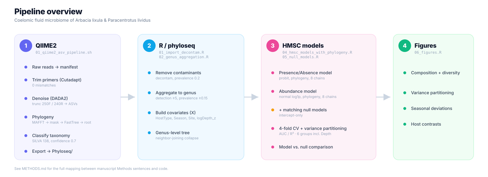

# Sea urchin coelomic fluid microbiome: QIIME2 + HMSC pipeline

Bioinformatic and statistical pipeline for the **coelomic fluid microbiome**
of the sea urchins *Arbacia lixula* and *Paracentrotus lividus* (with
surrounding seawater samples as environmental controls), from raw amplicon
reads to joint species distribution models (HMSC) and manuscript figures.

## Pipeline overview



The diagram above shows the pipeline as reported in the manuscript (QIIME2
→ R/phyloseq → HMSC models with phylogeny + matching null models →
figures). The repository also includes a no-phylogeny variant of the HMSC
models (`R/03_hmsc_models_no_phylogeny.R`), kept for reference only — it
is **not** part of the manuscript. See
[Repository structure](#repository-structure) and
[`METHODS.md`](METHODS.md) for details.

## Repository structure

```
.
├── README.md
├── METHODS.md                   # manuscript Methods ↔ code mapping (single source of truth)
├── install_dependencies.R       # one-shot R package installer
├── environment.yml              # QIIME2 conda environment
├── renv.lock                    # R package versions (see Setup) — generate with renv::snapshot()
├── docs/
│   └── pipeline_overview.svg    # diagram shown above
├── pipeline/
│   └── 01_qiime2_asv_pipeline.sh    # raw reads -> ASVs, taxonomy, tree, phyloseq export
├── R/
│   ├── 00_mcmc_config.R             # single source of truth for all MCMC settings
│   ├── 01_import_decontam.R         # import phyloseq, decontam, taxonomy cleanup, filtering
│   ├── 02_genus_aggregation.R       # aggregate to genus, build Y (counts) and X (covariates incl. logDepth_z)
│   ├── 03_hmsc_models_no_phylogeny.R
│   ├── 04_hmsc_models_with_phylogeny.R
│   ├── 05_null_models.R             # intercept-only null models + model-vs-null table
│   ├── 06_figures.R                 # master script: loads results, sources figures/*.R
│   └── figures/
│       ├── fig2_composition_diversity.R
│       ├── fig_variance_partitioning.R
│       ├── fig_seasonal_deviations.R
│       └── fig_host_contrasts.R
├── results/                     # .rds objects saved by R/01-05 (not tracked in git; see below)
├── figures/                     # .pdf / .png output of R/06_figures.R
└── data/
    └── README.md                 # how to obtain metadata_pbr2.tsv, raw reads, etc.
```

Large intermediate files (`results/*.rds`, raw reads, reference databases) are
not tracked in this repository. See `data/README.md` for how to regenerate
or download them.

## Setup

### QIIME2 (bash pipeline)

```bash
conda env create -f environment.yml
conda activate qiime2-2022.11
```

### R (statistical pipeline)

**Quick start** (installs latest versions, no version pinning):
```r
source("install_dependencies.R")
```

**Exact reproduction of the paper's package versions** (recommended once
you have a working setup — this captures what you actually have installed):
```r
install.packages("renv")
renv::init()
renv::snapshot()   # writes renv.lock; commit it so others can renv::restore()
```
If a `renv.lock` file already exists in the repo (generated this way by the
authors), others can instead run:
```r
install.packages("renv")
renv::restore()   # installs the exact versions listed in renv.lock
```

Key R packages: `phyloseq`, `decontam`, `microbiome`, `Hmsc`, `coda`,
`picante`, `ape`, `ggplot2`, `patchwork`, `ggh4x`, `qiime2R` (see
`install_dependencies.R` for the full list, including Bioconductor and
GitHub-only packages).

## Running the pipeline

1. **QIIME2** (on a machine/cluster with the raw fastq files):
   ```bash
   bash pipeline/01_qiime2_asv_pipeline.sh
   ```
   Produces the `Phyloseq/` export folder (biom table, rooted/unrooted tree,
   taxonomy, representative sequences) described in `data/README.md`.

2. **R / phyloseq + decontam + genus aggregation**:
   ```r
   source("R/01_import_decontam.R")
   source("R/02_genus_aggregation.R")
   ```

3. **HMSC models** (MCMC settings are centralized in
   `R/00_mcmc_config.R` — edit that single file if you need to change
   `samples` / `thin` / `transient` / `nChains` / `nParallel`):
   ```r
   source("R/03_hmsc_models_no_phylogeny.R")
   source("R/04_hmsc_models_with_phylogeny.R")
   source("R/05_null_models.R")
   ```

4. **Figures**:
   ```r
   source("R/06_figures.R")
   ```
   This loads every object the figure scripts need directly from the
   `.rds` files saved in step 3 (so figures can be regenerated without
   re-running MCMC), then produces, in order:
   - `figures/Figure2_composition_and_diversity.{pdf,png}`
   - `figures/FIGURE_VP_both_models.{pdf,png}`
   - `figures/FIGURE_seasonal_deviations_FINAL.{pdf,png}`
   - `figures/FIGURE_block4_ABUNDANCE.{pdf,png}` and `FIGURE_block4_PA.{pdf,png}`

## Methods ↔ code mapping

[`METHODS.md`](METHODS.md) links every sentence that will appear in the
manuscript's Methods section to the exact parameter and line of code that
produced it (trimming, DADA2 truncation lengths, classifier confidence,
rarefaction depths, HMSC MCMC settings, etc.). Check it before editing
either the manuscript text or the pipeline, so the two cannot silently
drift apart.

## MCMC settings (confirmed from fitted model objects)

| Model | samples | thin | transient | nChains |
|---|---|---|---|---|
| Presence/absence (with phylogeny) | 12000 | 50 | 4000 | 8 |
| Conditional abundance (with phylogeny) | 10000 | 20 | 6000 | 8 |

These values live in one place, `R/00_mcmc_config.R`, and are sourced by
every fitting script (`03`, `04`, `05`) so the manuscript's Methods /
Table SXX and the code cannot drift apart.

## Status

This repository accompanies a manuscript currently in preparation. A
citation (and DOI, once available as a preprint or published article) will
be added here.

## License

This project is licensed under the MIT License — see LICENSE for details.
